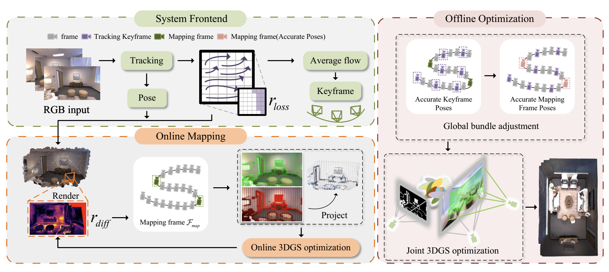
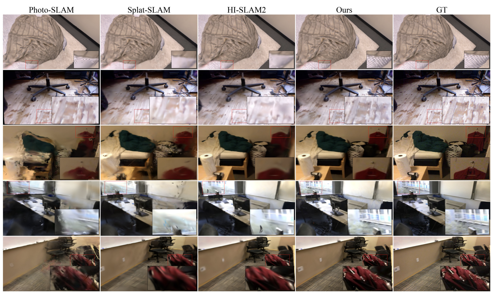

# IMGS-SLAM

IMGS-SLAM is a geometry-aware Gaussian SLAM system for fast monocular indoor reconstruction.

This repository accompanies the IEEE Robotics and Automation Letters 2026 paper:

IMGS-SLAM: Monocular Gaussian Splatting SLAM for Indoor Reconstruction.

## Description

IMGS-SLAM focuses on monocular indoor scene understanding and reconstruction with Gaussian representations. The method is designed to jointly support camera tracking, dense mapping, and high-quality scene reconstruction within a unified SLAM framework.

## Visual Results

  

  <em>Overview of the IMGS-SLAM pipeline.</em>

  

  <em>Qualitative comparison on challenging indoor scenes.</em>

## Experimental Summary

The visual examples above highlight the reconstruction quality and qualitative behavior of IMGS-SLAM on representative indoor scenes. The method is evaluated in the context of monocular SLAM and indoor reconstruction, with emphasis on geometry quality, rendering fidelity, and tracking robustness.

## Acknowledgement

This project builds on ideas and components from prior SLAM, Gaussian Splatting, and reconstruction systems, including DROID-SLAM, MonoGS, HI-SLAM2, FastGS, 3DGS, and evaluate_3d_reconstruction_lib.

## Citation

If you find this project useful, please cite the IMGS-SLAM paper published in IEEE Robotics and Automation Letters, 2026, DOI: 10.1109/LRA.2026.3709995.
